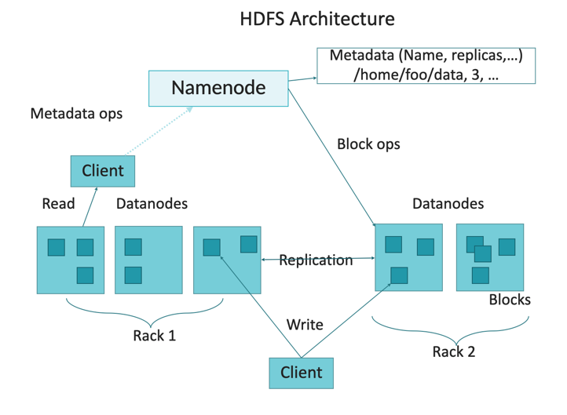
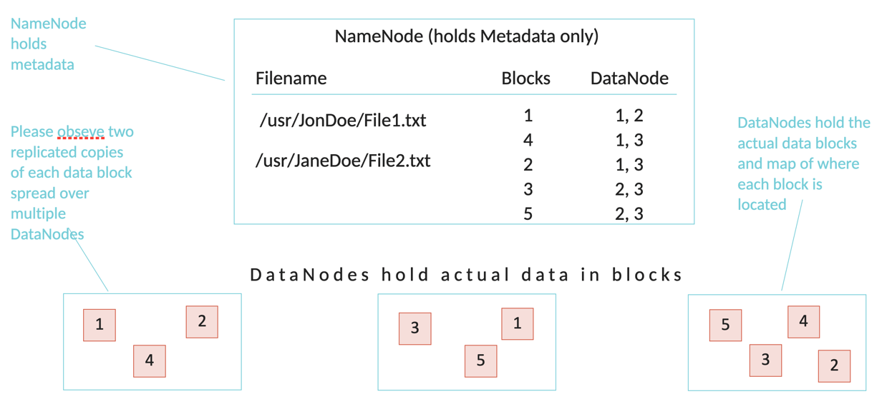
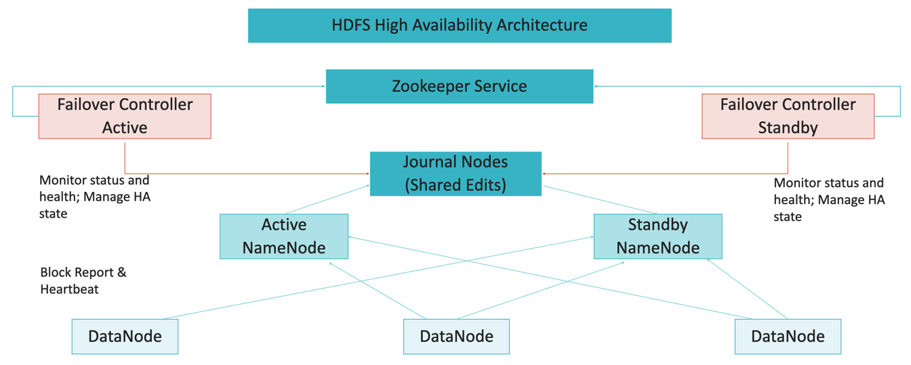

## Materials

 - [HDFS FileSystem](https://hadoop.apache.org/docs/r2.8.2/api/org/apache/hadoop/fs/FileSystem.html)
 - [hadoop-hdfs WebHDFS](https://hadoop.apache.org/docs/r2.7.3/hadoop-project-dist/hadoop-hdfs/WebHDFS.html)
 - [Apache Parquet](https://parquet.apache.org/documentation/latest/)

 - Architecture
   
   
### Namenode
 - NameNode daemon must be running at all times
 - If the NameNode stops, the cluster becomes inaccessible
 - The NameNode stores all metadata
    - file locations in HDFS
    - file ownership and permissions
    - Names of the individual blocks
    - Locations of the blocks
```
metadata	= fs image + edit log
fs image 		= paths + block ids + user + group + permissions	/ written in memory
edit log		= operations										/ written in disk
```

 
 - Node name with zookeeper

 
 - Checkpointing
   - dfs.namenode.checkpoint.period - specifies the maximum delay between two consecutive checkpoints; set to 1 hour by default
   - dfs.namenode.checkpoint.txns - defines the number of uncheckpointed transactions on the NameNode which will force an urgent checkpoint, even if the checkpoint period has not been reached; set to 1 million by default
   - hdfs secondarynamenode -checkpoint force – force checkpoint
   - Set dfs.namenode.name.dir and dfs.namenode.checkpoint.dir and run NameNode with
–importCheckpoint option to import backed up checkpoint (fsimage) at start
 - Web UI
   - NameNode, Secondary NameNode , Checkpoint and Backup Nodes, DataNodes, each run an internal web server in order to display basic information about the current status of the cluster
   - dfs.http.policy , dfs.client.https.need-auth and other config properties sets http(s) policies
   - Websites
     - Daemon						Port			Configuration
     - NameNode					50070		dfs.http.address
     - 50470		dfs.https.address
     - DataNode					50075		dfs.datanode.http.address
     - 50475		dfs.datanode.https.address
     - Secondary NameNode		50090		dfs.secondary.http.address
     - Backup/Checkpoint Nodes	50105		dfs.backup.http.address
   - HDFS has a lot of service RPC endpoints which are not listed here
 - DFS
   - Typical commands:
```
hdfs dfs –put foo.txt /tmp/foo.txt – copy local file foo.txt to /tmp/ directory
hdfs dfs –ls /users/training/f* - directory listing of directory /users/training/f*
hdfs dfs –cat foo.txt – print content of file foo.txt
hdfs dfs –mkdir /ttt – create directory /ttt
hdfs dfs –rm –R /ttt – remove directory /ttt recursively
```
 - DFSADMIN
   - dfsadmin command supports a few HDFS administration related operations
   - hdfs dfsadmin –help
   - -report
      - reports basic statistics (some of this information is also available on the NameNode web page)
   - -safemode
      - though usually not required, an administrator can manually enter or leave safemode
   - -finalizeUpgrade
      - removes previous backup of the cluster made during last upgrade
   - -refreshNodes
      - updates the NameNode with the set of DataNodes allowed to connect to the NameNode
      - DataNodes complete decommissioning when all the replicas from them are replicated to other
      - decommissioned nodes are not automatically shutdown
      - but they are not chosen for writing for new replicas
   - -printTopology
      - print the topology of the cluster
      - displays a tree of racks and DataNodes attached to the tracks as viewed by the NameNode
 - utils
   - hdfs fsck - utility to diagnose health of the file system, to find missing files or blocks
   - Unlike a traditional fsck utility for native file systems, it doesn’t correct the errors it detects
   - Normally NameNode automatically corrects most of the recoverable failures
   - By default fsck ignores open files but provides an option to select all files during reporting
 - Format
   - hdfs dfs -rm -r "/*“
   - hadoop fs –expunge
   - Stop your cluster
   - Delete data dirs for every node (configured in conf/hdfs-site.xml)
   - hdfs namenode –format
   - Start your cluster
 - HDFS: tracing
    - Dapper-like tracing is supported using the open source tracing library: Apache HTrace
    - Configure hadoop.htrace.sampler:
      - NeverSampler - HTrace is OFF for all spans
      - AlwaysSampler - HTrace is ON for all spans
      - ProbabilitySampler - HTrace is ON for some percentage% of top-level spans
    - Implement SpanReceiver and configure hadoop.htrace.spanreceiver.classes (can contain several classes) and hadoop.htrace.local-file-span-receiver.path (to write to file)
    - There is out-of-the-box ZipkinSpanReceiver
      - Zipkin is a distributed tracing system, used by Twitter and others
      - In order to use ZipkinSpanReceiver, you need to download and setup Zipkin first
      - You also need to add the jar of htrace-zipkin to the classpath of Hadoop on each node
      - Configure: add ZipkinSpanReceiver to hadoop.htrace.spanreceiver.classes, set hadoop.htrace.zipkin.collector-hostname and hadoop.htrace.zipkin.collector-port
    - You can use hadoop trace command to see and update the tracing configuration of each servers
 - HADOOP: Log GC
   - NameNode, DataNode, ResourceManager, NodeManager and others – are just Java applications
   - It means that you can play with such Java options as
      - -verbose:gc
      - -Xloggc:[file]
      - -XX:-PrintGCDetails
      - -XX:+PrintGCTimeStamps
   - Can be set in JAVA_OPTS for NameNode of DataNode and others
      - HADOOP_NAMENODE_OPTS= or HADOOP_DATANODE_OPTS= in hadoop-env.sh file
   - Use these options to discover if GC is straggler for performance
 - HADOOP: local analysis
   - hdfs jmxget – dump JMX information from a service
   - Analyze local performance and blocking operations
      - sudo jstack -F [datanode-pid] – get stack for Java theads
      - sudo -u hdfs jstack -F [datanode-pid] – can show different information !!
   - Analyze local heap
      - sudo jmap -histo [pid] – gets a histogram of objects in the JVM heap
      - sudo jmap -histo:live [pid] – gets a histogram of objects in the heap after GC (thus “live”)
      - jhat - parses dump file and launches a webserver for convenient browsing
   - Use any other your favourite profiling tool, like VisualVM, YourKit, performance counters from Ambari (Ganglia + Nagios) and Cloudera Manager, process monitors like atop/htop, etc


