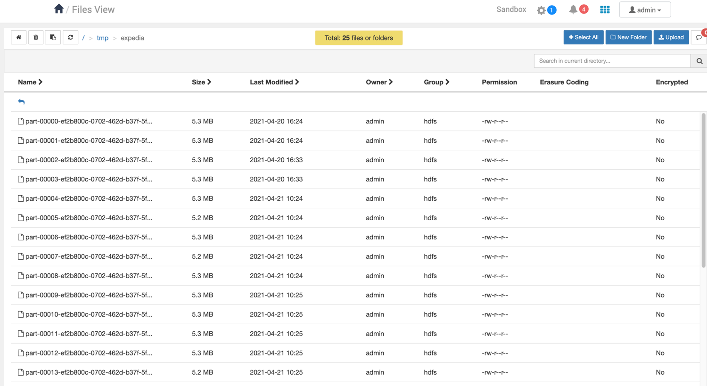

## Task 1
 - Download the data set [here](#).
 - Unzip these files and put them in HDFS system with the same hierarchy as they are in archive.
 - Make screenshots of data in HDFS from console & Ambari view.
 - Though Hadoop API, Parquet and Avro Tools (1.7.x version of avro tools is compatible with 3.x HDP) receive schema from Avro (Expedia) & Parquet (Weather) files.
 - Make screenshots of schema in console.
 - Collect rows count in Avro (Expedia) dataset.
 - Make screenshots of output.

### Uploaded files
 - expedia
 

### Not clear
 - Though Hadoop API, Parquet and Avro Tools (1.7.x version of avro tools is compatible with 3.x HDP) receive schema from Avro (Expedia) & Parquet (Weather) files.
   - I'm using HDF_3.1.1 and can't find specified tools
 - Collect rows count in Avro (Expedia) dataset.
   - not clear with Avro (i do not have it in my menu)

