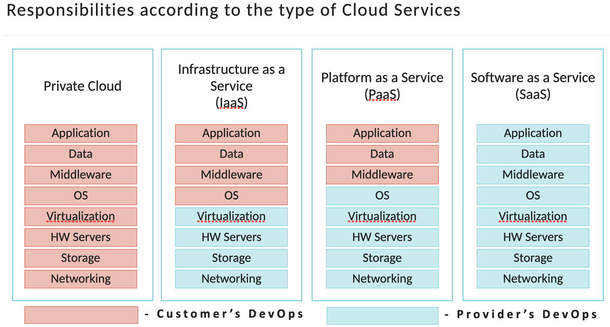
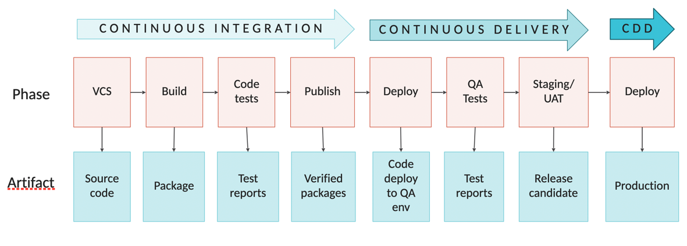

### Responsibilities according to the type of Cloud Services


### GIT and branching models
 - Mainline
 - Git flow
 - Github flow
 - Gitlab flow

### CI/CD Pipelines


### Docker operations
Create a container using Dockerfile
```
docker build -t image-name /path-to/context
```
Run a container
```
docker run -it -p 8080 –v volume-name:/path/to/mount image-name
```
Get list of running containers with ports
```
docker ps
```
Kill a container
```
docker kill container-id
```
Remove image
```
docker image rm image-name
```
### Docker basic troubleshooting
Examine a list of images
```
docker image list -a
```
Examine running list
```
docker ps -a
```
Get container logs
```
docker logs -f containter-id
```
Execute a command (run a shell) inside
```
docker exec -it container-id bash
```
Check networks, proxy settings (if needed)
```
docker network ls
ENV HTTP_PROXY "http://127.0.0.1:3128"
```

### Making infrastructure actionable, scalable and intelligent
 - Puppet
 - Ansible
 - Chef

