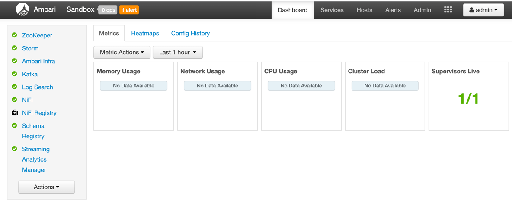
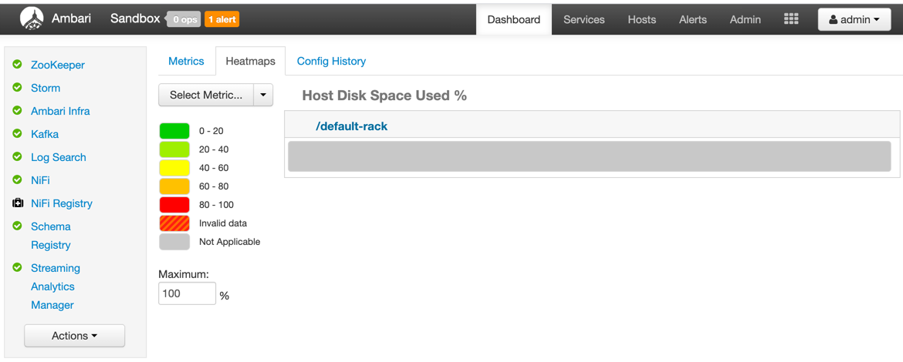
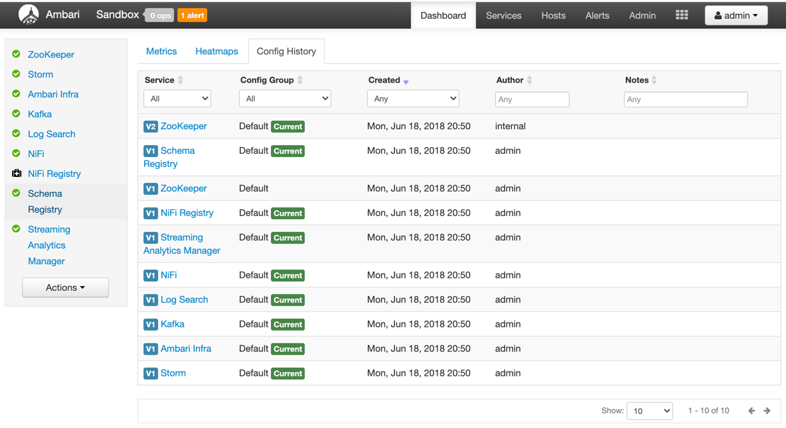
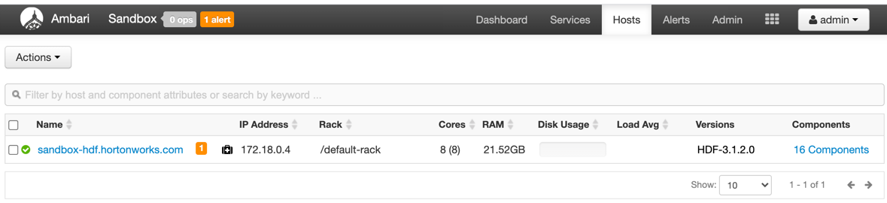
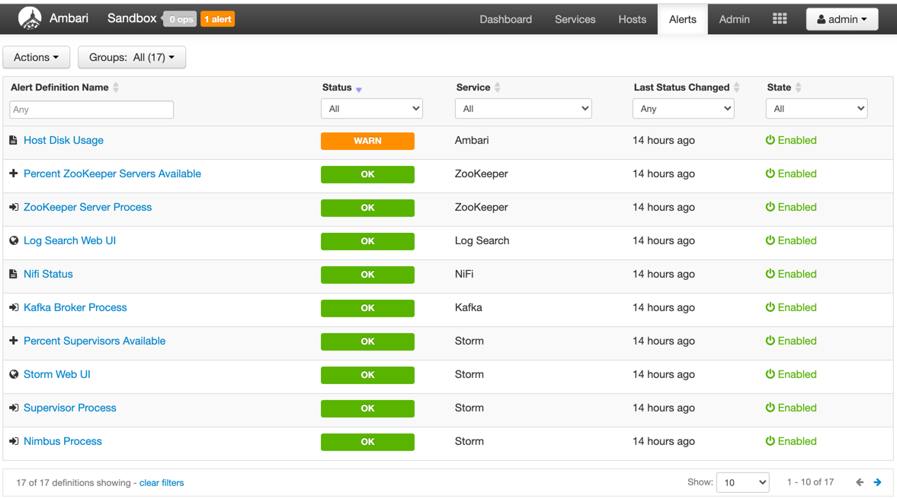
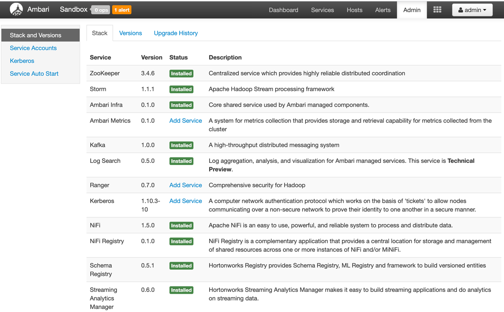
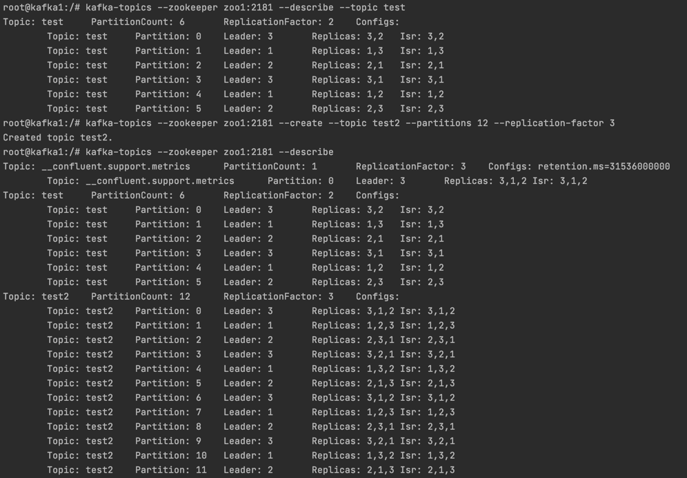
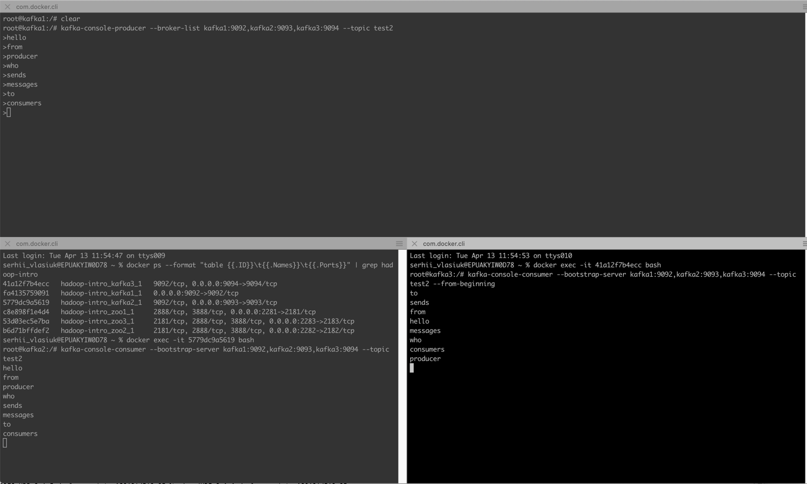

# Hadoop intro

## Task 1

### Manage HDP
 - [Hortonworks Data Platform (HDP®) on Hortonworks Sandbox](https://www.cloudera.com/downloads/hortonworks-sandbox/hdp.html)
 - [Sandbox Deployment and Install Guide](https://www.cloudera.com/tutorials/sandbox-deployment-and-install-guide/3.html)

### Manage CDF
 - [Learning the Ropes of the CDF Sandbox](https://www.cloudera.com/tutorials/learning-the-ropes-of-the-cdf-sandbox.html)

**Mac users**:

    echo '{IP-Address} sandbox-hdp.hortonworks.com sandbox-hdf.hortonworks.com' | sudo tee -a /private/etc/hosts

**Linux users**:

```
    echo '{IP-Address} sandbox-hdp.hortonworks.com sandbox-hdf.hortonworks.com' | sudo tee -a /etc/hosts
```
```
    ssh root@sandbox-hdf.hortonworks.com -p 2202
```
 - [shell web client](sandbox-hdf.hortonworks.com:4200)

**Send Data Between Sandbox and Local Machine**

Using the terminal of your choice, you can transfer files to/from sandbox and local machine.

 - Transfer file from local machine to sandbox:
```
scp -P 2202 <local_directory_file> root@sandbox-hdf.hortonworks.com:<sandbox_directory_file>
```
 - Transfer file from sandbox to local machine:
```
scp -P 2202 root@sandbox-hdf.hortonworks.com:<sandbox_directory_file> <local_directory_file>
```
 - [Splash Page](http://sandbox-hdf.hortonworks.com:1080/)
 - [Explore Ambari](http://sandbox-hdf.hortonworks.com:8080)
   - [Admin Password Reset](https://www.cloudera.com/tutorials/learning-the-ropes-of-the-cdf-sandbox.html#admin-password-reset)
   - 
   - 
   - 
   - 
   - 
   - 

 - [Step 1: Explore Dataflow Application](http://sandbox-hdf.hortonworks.com:9090/nifi/)
 - [Step 2: View Schema Registry](http://sandbox-hdf.hortonworks.com:7788/ui/)
 - [Sandbox HDFS Docker Downloads](https://www.cloudera.com/downloads/hortonworks-sandbox/hdf.html)
 - [Step 3: Analyze Stream Analytics Application](http://sandbox-hdf.hortonworks.com:7777/)
 - [Step 4: View the Storm Engine that Powers SAM]()

### Manage HDF
 - [Cloudera DataFlow (Ambari) on Sandbox](https://www.cloudera.com/downloads/hortonworks-sandbox/hdf.html)


### for my local configuration(helper)
```
cd /Users/serhii_vlasiuk/projects/learning/cloudera/HDP_2.6.5_deploy-scripts_180624d542a25
sh docker-deploy-hdp265.sh

docker stop sandbox-hdp
docker stop sandbox-proxy
docker start sandbox-hdp
docker start sandbox-proxy
docker rm sandbox-hdp
docker rm sandbox-proxy
docker rmi hortonworks/sandbox-hdp:{release}
```

## Task 2
 - Install Kafka service if not installed by default. Run and make screenshots of running service.
```
docker-compose -f hadoop-intro/zk-multiple-kafka-multiple.yml up -d
docker-compose -f hadoop-intro/zk-multiple-kafka-multiple.yml ps
docker-compose -f hadoop-intro/zk-multiple-kafka-multiple.yml logs
```
To stop kafka with deleting containers use next command
```
docker-compose -f hadoop-intro/zk-multiple-kafka-multiple.yml down
```
 - Create a new topic via CLI, write a message in a console producer and read it in console consumer. Make screenshots.
```
docker ps
docker ps --format "table {{.ID}}\t{{.Names}}\t{{.Ports}}" | grep hadoop-intro
```
enter inside of container
```
docker exec -it KAFKA_CONTAINER_ID bash
kafka-topics --zookeeper zoo1:2181 --create --topic test --partitions 6 --replication-factor 2
kafka-topics --zookeeper zoo1:2181 --describe --topic test
kafka-topics --zookeeper zoo1:2181 --create --topic test2 --partitions 12 --replication-factor 3
kafka-topics --zookeeper zoo1:2181 --describe
```

```
kafka-console-producer --broker-list kafka1:9092,kafka2:9093,kafka3:9094 --topic test2
docker exec -it KAFKA_CONTAINER2_ID bash
kafka-console-consumer --bootstrap-server kafka1:9092,kafka2:9093,kafka3:9094 --topic test2
docker exec -it KAFKA_CONTAINER3_ID bash
kafka-console-consumer --bootstrap-server kafka1:9092,kafka2:9093,kafka3:9094 --topic test2 --from-beginning
```

