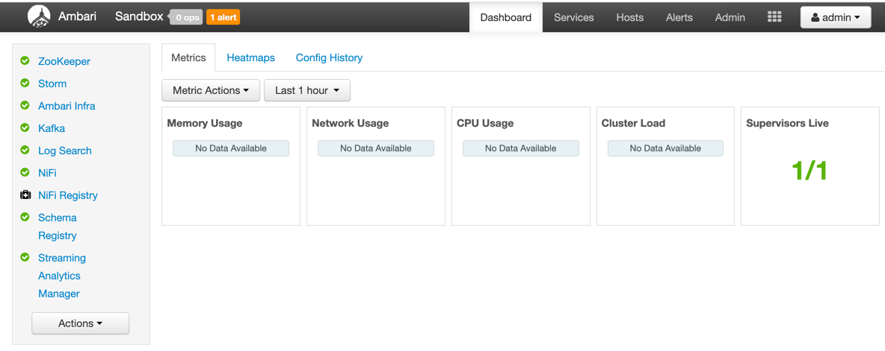
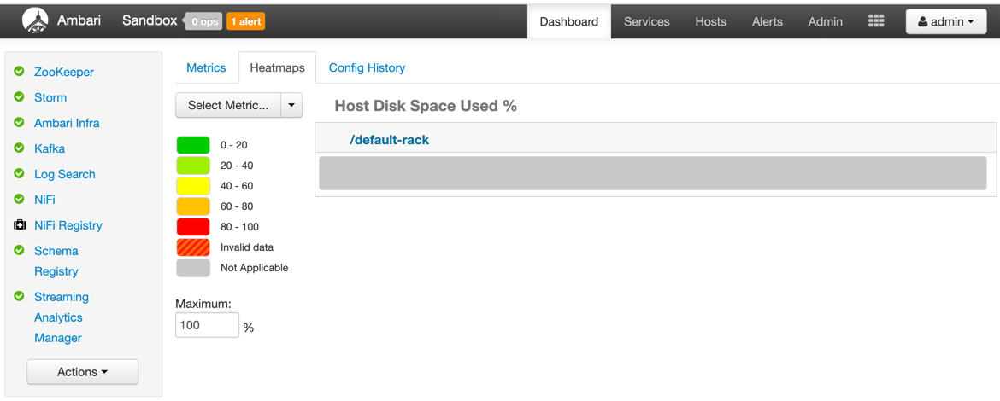
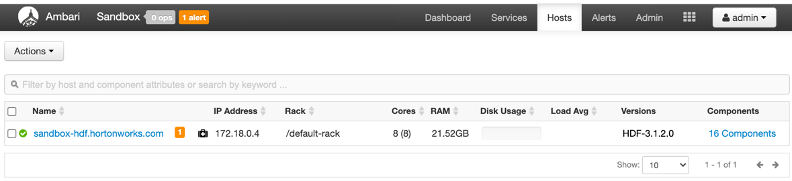
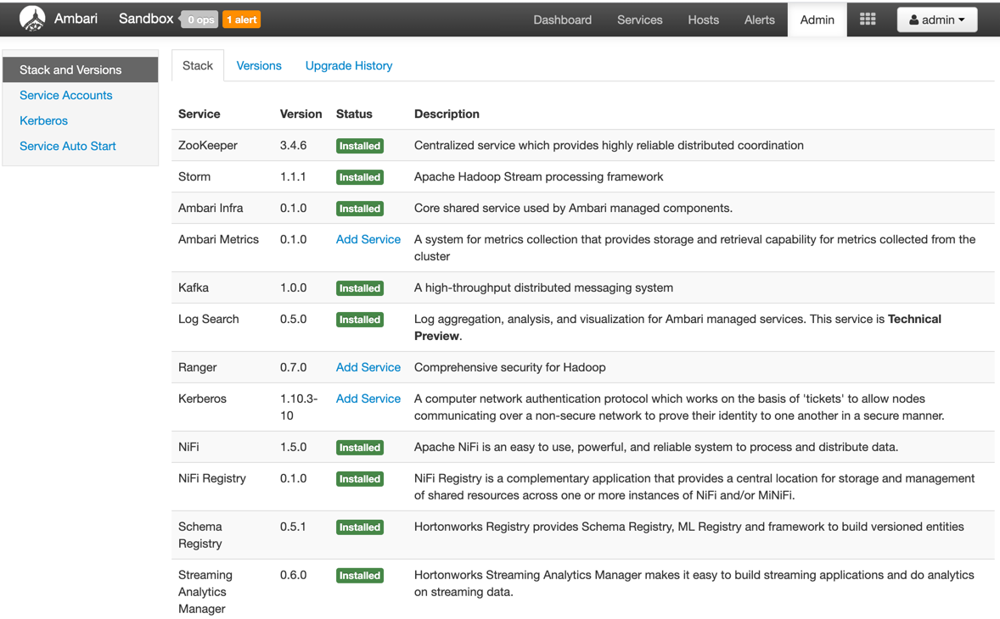

## Task 1

### Manage HDP
- [Hortonworks Data Platform (HDP®) on Hortonworks Sandbox](https://www.cloudera.com/downloads/hortonworks-sandbox/hdp.html)
- [Sandbox Deployment and Install Guide](https://www.cloudera.com/tutorials/sandbox-deployment-and-install-guide/3.html)

### Manage CDF
- [Learning the Ropes of the CDF Sandbox](https://www.cloudera.com/tutorials/learning-the-ropes-of-the-cdf-sandbox.html)

**Mac users**:

    echo '{IP-Address} sandbox-hdp.hortonworks.com sandbox-hdf.hortonworks.com' | sudo tee -a /private/etc/hosts

**Linux users**:

```
    echo '{IP-Address} sandbox-hdp.hortonworks.com sandbox-hdf.hortonworks.com' | sudo tee -a /etc/hosts
```
```
    ssh root@sandbox-hdf.hortonworks.com -p 2202
```
password: `hadoop`

- [shell web client](sandbox-hdf.hortonworks.com:4200)

**Send Data Between Sandbox and Local Machine**

Using the terminal of your choice, you can transfer files to/from sandbox and local machine.

- Transfer file from local machine to sandbox:
```
scp -P 2202 <local_directory_file> root@sandbox-hdf.hortonworks.com:<sandbox_directory_file>
```
- Transfer file from sandbox to local machine:
```
scp -P 2202 root@sandbox-hdf.hortonworks.com:<sandbox_directory_file> <local_directory_file>
```
- [Splash Page](http://sandbox-hdf.hortonworks.com:1080/)
- [Explore Ambari](http://sandbox-hdf.hortonworks.com:8080)
    - [Admin Password Reset](https://www.cloudera.com/tutorials/learning-the-ropes-of-the-cdf-sandbox.html#admin-password-reset)
    - 
    - 
    - 
    - 
    - 
    - 

- [Step 1: Explore Dataflow Application](http://sandbox-hdf.hortonworks.com:9090/nifi/)
- [Step 2: View Schema Registry](http://sandbox-hdf.hortonworks.com:7788/ui/)
- [Sandbox HDFS Docker Downloads](https://www.cloudera.com/downloads/hortonworks-sandbox/hdf.html)
- [Step 3: Analyze Stream Analytics Application](http://sandbox-hdf.hortonworks.com:7777/)
- [Step 4: View the Storm Engine that Powers SAM]()

### Manage HDF
- [Cloudera DataFlow (Ambari) on Sandbox](https://www.cloudera.com/downloads/hortonworks-sandbox/hdf.html)


### for my local configuration(helper)
#### for hdp
```
cd /Users/serhii_vlasiuk/projects/learning/cloudera/HDP_2.6.5_deploy-scripts_180624d542a25
sh docker-deploy-hdp265.sh

docker stop sandbox-hdp
docker stop sandbox-proxy
docker start sandbox-hdp
docker start sandbox-proxy
docker rm sandbox-hdp
docker rm sandbox-proxy
docker rmi hortonworks/sandbox-hdp:{release}

sh enable-native-cda.sh
```
#### for hdf
```
cd ../HDF_3.1.1_deploy-scripts_180624d542a25
sh docker-deploy-hdf311.sh
```
