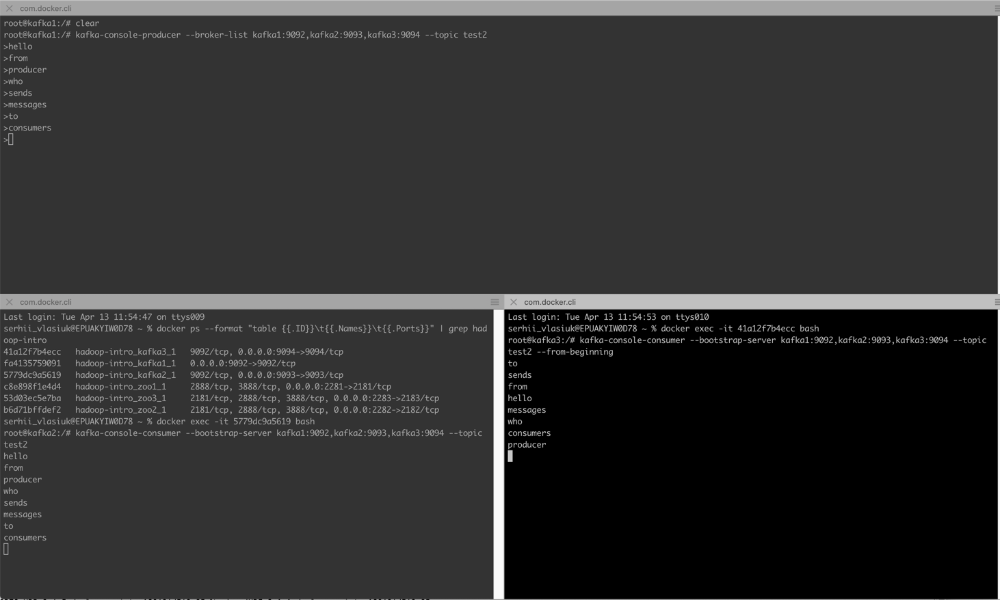

## Task 2
- Install Kafka service if not installed by default. Run and make screenshots of running service.
```
docker-compose -f hadoop-intro/zk-multiple-kafka-multiple.yml up -d
docker-compose -f hadoop-intro/zk-multiple-kafka-multiple.yml ps
docker-compose -f hadoop-intro/zk-multiple-kafka-multiple.yml logs
```
To stop kafka with deleting containers use next command
```
docker-compose -f hadoop-intro/zk-multiple-kafka-multiple.yml down
```
- Create a new topic via CLI, write a message in a console producer and read it in console consumer. Make screenshots.
```
docker ps
docker ps --format "table {{.ID}}\t{{.Names}}\t{{.Ports}}" | grep hadoop-intro
```
enter inside of container
```
docker exec -it KAFKA_CONTAINER_ID bash
kafka-topics --zookeeper zoo1:2181 --create --topic test --partitions 6 --replication-factor 2
kafka-topics --zookeeper zoo1:2181 --describe --topic test
kafka-topics --zookeeper zoo1:2181 --create --topic test2 --partitions 12 --replication-factor 3
kafka-topics --zookeeper zoo1:2181 --describe
```

```
kafka-console-producer --broker-list kafka1:9092,kafka2:9093,kafka3:9094 --topic test2
docker exec -it KAFKA_CONTAINER2_ID bash
kafka-console-consumer --bootstrap-server kafka1:9092,kafka2:9093,kafka3:9094 --topic test2
docker exec -it KAFKA_CONTAINER3_ID bash
kafka-console-consumer --bootstrap-server kafka1:9092,kafka2:9093,kafka3:9094 --topic test2 --from-beginning
```


### Other
 - [Kafka tutorial with examples](https://www.javatpoint.com/kafka-real-time-example)
 - [Kafka docker containers](https://github.com/conduktor/kafka-stack-docker-compose)
 - [Kafka security](https://docs.confluent.io/platform/current/schema-registry/schema-validation.html#mtls-mutual-tls-authentication)
