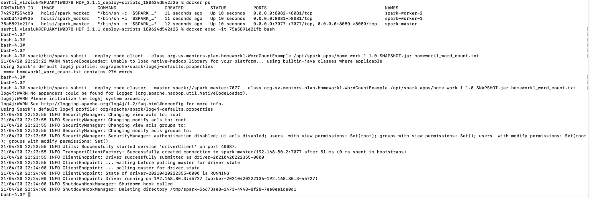
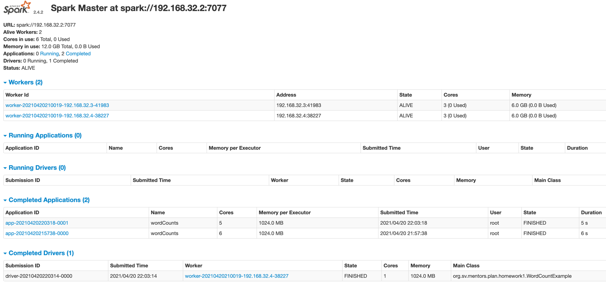

# Homework 1

## Start docker

    docker-compose -f mentors-plan/home-work-1/docker-compose.yml up -d
    
    docker ps
    docker exec -it docker_id bash

### Submit in client mode

    spark/bin/spark-submit --deploy-mode client --class org.sv.mentors.plan.homework1.WordCountExample /opt/spark-apps/home-work-1-1.0-SNAPSHOT.jar homework1_word_count.txt

### Submit in master mode

    spark/bin/spark-submit --deploy-mode cluster --master spark://spark-master:7077 --class org.sv.mentors.plan.homework1.WordCountExample /opt/spark-apps/home-work-1-1.0-SNAPSHOT.jar homework1_word_count.txt

